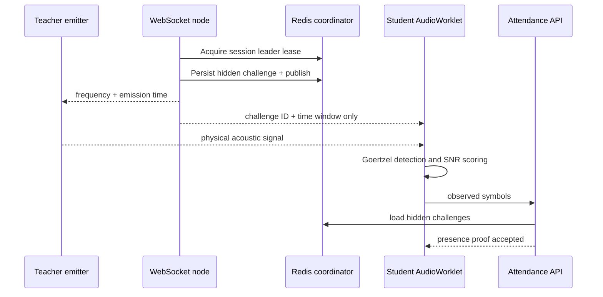

# ClassPulse Presence Protocol v2

## Security objective

ClassPulse verifies that an authenticated student device observed a short-lived
classroom signal. It is designed to resist copied static tones, replayed API
payloads, password sharing, and modified clients that attempt to submit the
server's expected answer without using a microphone.

It does not claim to defeat a sufficiently fast live relay operated by a
colluding person inside the classroom. Preventing every relay requires trusted
hardware or supervised identity checks.

## Acoustic protocol

1. The teacher opens an authenticated WebSocket using a short-lived HMAC ticket.
2. A Redis-elected leader derives a challenge for the next time slot using
   HMAC-SHA-256 and `PRESENCE_PROOF_SECRET`.
3. Only teacher sockets receive the expected frequency.
4. Student sockets receive a challenge identifier and time window, but never
   the expected frequency.
5. The teacher device emits the tone during the scheduled window.
6. An `AudioWorklet` on the student device evaluates the configured frequency
   bank with the Goertzel algorithm.
7. The student submits the strongest observed frequency, local detection time,
   amplitude and signal-to-noise ratio.
8. The server loads the hidden challenge from Redis, validates its HMAC
   commitment, checks frequency/timing tolerances, requires a continuous
   multi-symbol sequence, and rate-limits guesses.



## Passkey-confirmed verification

Students may register one or more passkeys. When passkeys exist:

1. A valid location or acoustic proof creates a short-lived
   `PresenceVerification`.
2. The server generates a random WebAuthn challenge and stores it with that
   verification.
3. The authenticator performs user verification and signs the challenge.
4. The server validates the RP ID, origin, signature, user-verification flag and
   authenticator counter.
5. Only then is the attendance record created with `deviceVerified = true`.

Students without a passkey can still check in, but the record is visibly marked
as standard assurance rather than passkey-confirmed.

After device binding is enabled, adding or removing authenticators requires an
assertion from an existing passkey. The first registration also generates eight
one-time recovery codes. A saved recovery code can authorize a replacement
passkey for two minutes without weakening the normal management flow to
password-only authorization. The final passkey cannot be deleted until a
replacement exists.

Passkey confirmation establishes control of a registered credential, not a
unique physical device or a verified student identity. Synced (multi-device)
passkeys are supported. Reports say **passkey-confirmed**; stored evidence
separately records the credential device type and backup state.

## Multi-instance coordination

- An atomic Lua script acquires or renews a lease only for its current owner.
- A second script checks ownership, claims the slot, stores the challenge, and
  publishes it atomically. A delayed former owner cannot publish after losing
  its lease. PostgreSQL persists the challenge commitment before publication.
- Redis Pub/Sub broadcasts challenges to WebSocket nodes.
- Every node reveals the frequency only to teacher-role sockets.
- Challenges are stored under independent expiring keys for API validation.
- When REDIS_URL is configured, coordinator outages pause acoustic challenges
  and distributed rate limits fail closed. UI feedback reports the interruption.
  Local coordination is used only when REDIS_URL is explicitly absent. Running
  multiple nodes without Redis is unsupported.

Frequency banks are deterministic HMAC-shuffled permutations. Boundary swaps
prevent adjacent repeated frequencies without mutable sequence state. Observing
most of a bank reduces uncertainty about its remaining symbols: this is a
freshness mechanism, not a cryptographic proof of microphone use. Signal
strength and timestamps are supplied by the client and can be forged by a
modified client. They are quality checks, not trusted sensor attestations.

## Transaction invariants

- Proof creation, confirmation, closure, and sealing lock the same session row.
- Writers recheck active status, expiry, enrollment, and sealing after acquiring
  the lock. A request started before closure cannot append after closure.
- Passkey confirmation atomically consumes the exact challenge and proof hash
  that the assertion was verified against. Replacement proofs invalidate old assertions.
- Repeated session closure is idempotent; it cannot change a signed end time.
- Attendance records remain unique per student and session. Sealed event chains
  reject further material events.

## Tamper-evident reports

Every material action is appended to `AttendanceAuditEvent`. An event hash binds:

- session ID and sequence number;
- event type;
- pseudonymous actor ID;
- canonical JSON payload;
- previous event hash;
- creation timestamp.

Closing a session seals the current chain head into a report payload. The
payload is signed with a deterministic Ed25519 key derived from the independent
`ATTENDANCE_SIGNING_SECRET`. The report contains its public key, signature,
payload digest and signing-key fingerprint.

Downloaded artifacts can be checked without the application:

```bash
npm run report:verify -- classpulse-report-REPORT_ID.json \
  --trusted-key=BASE64URL_PUBLIC_KEY
```

The deployment publishes its current Ed25519 identity at
`/api/attendance/signing-key`. Verifiers should pin that public key through a
trusted channel. Checking an artifact without a pinned key still detects
tampering, but only proves self-consistency: an attacker could otherwise replace
both an artifact and its embedded public key.

## Threat model

| Threat | Mitigation | Residual risk |
| --- | --- | --- |
| Copying one tone | HMAC-derived frequency hopping and multi-symbol proof | A live in-room relay can forward new symbols |
| Reading expected frequency from student WebSocket | Role-isolated messages never disclose it | Teacher devices are trusted emitters |
| Guessing hidden symbols | 17-frequency space, continuous sequence and API rate limits | Security depends on high-entropy secrets |
| Replaying old proof payloads | Short challenge TTL, freshness window and unique attendance record | Compromised server credentials remain privileged |
| Sharing account password | Optional WebAuthn user verification | A student can lend an unlocked registered device |
| Using a stolen password to replace trusted devices | Existing-passkey authorization and one-time recovery codes | Compromise of both password and recovery code can authorize replacement |
| Editing database history | Hash chain and Ed25519-signed receipt | Database owner with signing secret can re-sign data |
| Losing one WebSocket instance | Redis leader expiry and ownership-checked publication | Redis outage pauses acoustic verification |

## Privacy properties

- Raw microphone audio never leaves the browser.
- Expected frequencies are not disclosed to student clients.
- Exact coordinates are reduced to distance and accuracy evidence before
  persistence.
- Audit events use an HMAC-derived pseudonymous actor identifier.
- Authenticator biometric data stays inside the authenticator; ClassPulse stores
  only the public credential and verification metadata.
